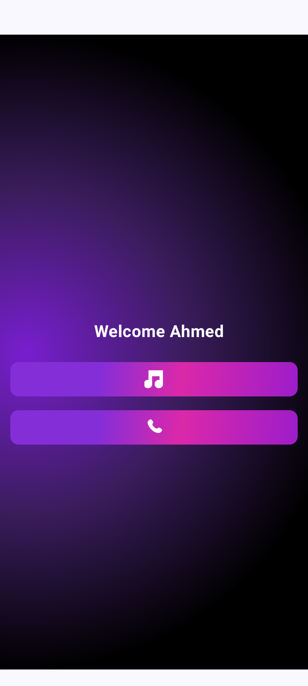
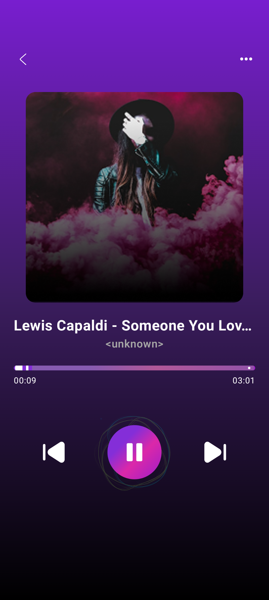
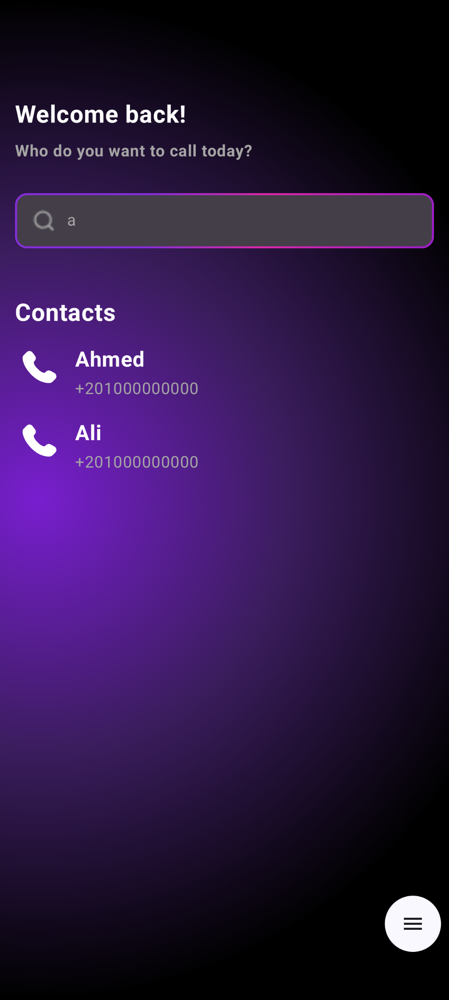
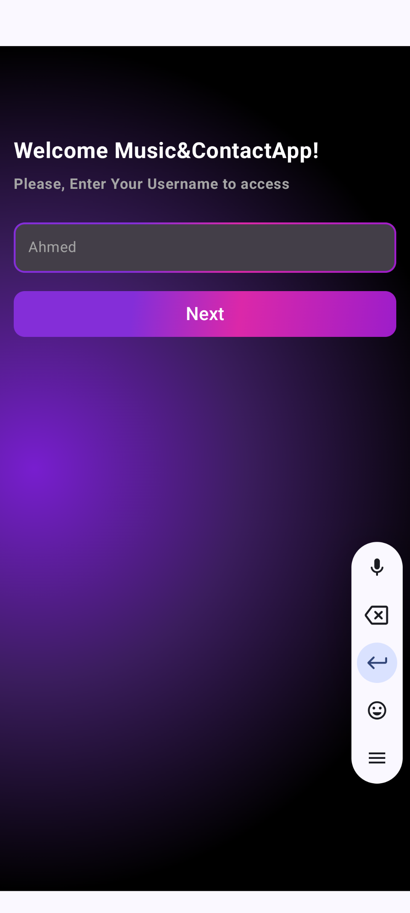

# 🎵 Music & Contact App (Jetpack Compose + MVI + Clean Architecture)

**Music & Contact App** is a sleek, Kotlin-based Android application built with **Jetpack Compose**, **MVI**, and **Clean Architecture**. It allows users to browse and play music from their device, manage contacts, and make calls directly from the app. The app features a modern, responsive UI with animated gradient backgrounds and dynamic state management using **Kotlin Coroutines**, **StateFlow**, and **Unidirectional MVI flow**.

---

## 📸 Screenshots

### 🔹 Screen Previews (1/2)

| Musics Screen | Play Screen | Contacts Screen |
|------------------|----------------|----------------|
|  |  |  |

### 🔹 Screen Previews (2/2)

| Choice Screen | Username Screen | Inactive TextField |
|------------------|-------------|----------------------------|
|  |  |  |

---

## 📱 Key Screens & Features

- **Username Screen**
  - User enters their name to personalize experience
  - Navigates to main selection screen

- **Choice Screen**
  - Navigate to either Musics or Contacts
  - Personalized greeting with radial gradient background

- **Musics Screen**
  - Lists all device music files via `MediaStore`
  - Search functionality by title or artist
  - Displays music metadata and image placeholders

- **Contacts Screen**
  - Lists all contacts using `ContactsContract`
  - Real-time search by name or number
  - Allows direct call initiation

- **Play Screen**
  - Foreground playback service with notification
  - Playback controls (play, pause, next, seek)
  - Lottie animation, disabled if battery is low

---

## 🧠 Technologies Used

| Technology | Purpose |
|------------|---------|
| **Kotlin** | Core programming language |
| **Jetpack Compose** | Declarative UI framework |
| **Kotlin Coroutines** | Async & concurrent operations |
| **MVI** | State & intent-based architecture |
| **Clean Architecture** | Layered structure (UI, Domain, Data) |
| **Hilt** | Dependency injection |
| **Jetpack Navigation** | Type-safe screen navigation |
| **MediaStore** | Access device music |
| **ContactsContract** | Access device contacts |
| **MediaPlayer** | Music playback |
| **StateFlow** | Reactive state management |
| **Lottie** | Animated visual feedback |
| **Foreground Service** | Persistent background music playback |
| **SharedPreferences** (assumed) | Persist settings (username, etc.) |

---

## ⚙️ Core Features

✅ Personalized entry via username  
✅ Browse, search, and play music  
✅ Foreground service with media controls  
✅ Access & search phone contacts  
✅ Make calls from within the app  
✅ Reactive UI with StateFlow & MVI  
✅ Dynamic permission handling  
✅ Beautiful Compose UI with gradients  
✅ Lottie animations (battery-aware)  
✅ Type-safe navigation  

---

## 🧱 Project Architecture

### 🧩 Clean Architecture + MVI

#### 1️⃣ UI Layer
- Composable Screens (`UsernameScreen`, `ChoiceScreen`, `MusicsScreen`, `ContactsScreen`, `PlayScreen`)
- ViewModels with:
  - `StateFlow<State>`
  - `onEvent(Intent)` function
- UI ↔ Domain mappers

#### 2️⃣ Domain Layer
- Use Cases (`GetMusicListUseCase`, `SearchContactsUseCase`, etc.)
- Business logic only
- Pure Kotlin, testable functions

#### 3️⃣ Data Layer
- Repositories (`MusicRepositoryImpl`, `ContactRepositoryImpl`)
- Platform APIs (`MediaStore`, `ContactsContract`, `MediaPlayer`)
- Mappers for data ↔ domain

---

## 🔁 MVI Flow

```plaintext
User Action → Intent → ViewModel → UseCase → Reducer → StateFlow → UI
Intent: All user interactions

Reducer: Maps events into new state

State: Single source of truth

Unidirectional, predictable, testable

🔨 Installation
bash
Copy
Edit
git clone https://github.com/your-username/music-contact-app.git
cd music-contact-app
Open in Android Studio

Run on emulator or physical device (API 21+)

Grant required permissions:

READ_MEDIA_AUDIO / READ_EXTERNAL_STORAGE

READ_CONTACTS

POST_NOTIFICATIONS (Android 13+)


